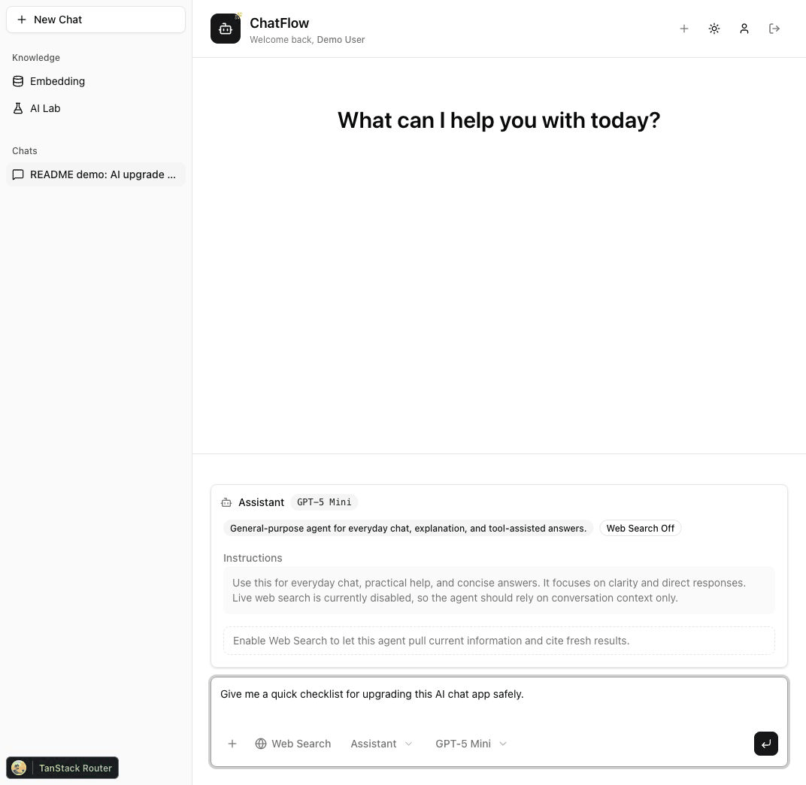

# Chat App

AI chat application built with a Bun workspace, React client, Hono API, PostgreSQL, Redis, and the AI SDK.




## Overview

The repo is organized as a Bun workspace with three packages:

- `client/` - React app built with Vite and TanStack Router
- `server/` - Hono API, auth, AI streaming, and database code
- `shared/` - shared schemas, model metadata, tool definitions, and UI message types

The repo also includes a Helm chart under `helm/chat-app/` and helper scripts for local Kubernetes workflows.

## Features

- Streaming chat responses through the AI SDK
- Cookie-based auth for register, login, logout, and current user
- Persistent conversations in PostgreSQL
- Shared Zod schemas and TypeScript types across client and server
- Structured output endpoints for planning and LLM-as-judge evaluation
- Approval-gated web search with Serper
- File attachments in chat input
- Mermaid rendering loaded lazily for markdown diagrams
- Optional Langfuse telemetry through OpenTelemetry
- Optional Sentry monitoring for client and server
- Docker Compose and local Kubernetes workflows

## Stack

- Runtime and package manager: Bun
- Frontend: React 19, Vite, TanStack Router, TanStack Query, Tailwind CSS
- Backend: Hono, Drizzle ORM, Zod, OpenAPI metadata
- AI: AI SDK, OpenAI provider, Langfuse telemetry
- Data: PostgreSQL, Redis
- Infra: Docker, Nginx, Traefik, Helm, Kubernetes Gateway API

## Repository Layout

```text
client/                 React client
server/                 Hono API and database code
shared/                 Shared contracts and AI/tool definitions
helm/chat-app/          Helm chart
scripts/                Local deployment and setup helpers
compose.yml             Docker Compose stack
Dockerfile              Client and server production images
Makefile                Common local, Docker, and Kubernetes commands
docs/                   Architecture, security, eval, and policy docs
```

## Prerequisites

- Bun `1.x`
- Docker Desktop or OrbStack
- `kubectl` and `helm` for Kubernetes workflows
- OpenAI API key

Optional:

- Serper API key for web search
- Langfuse keys for telemetry
- GitHub OAuth credentials for the GitHub login provider

## Setup

Create a local `.env`:

```bash
make setup
```

Then edit `.env`. At minimum set:

```text
OPENAI_API_KEY=
BETTER_AUTH_SECRET=
DB_PASSWORD=
```

For GitHub login:

```text
GITHUB_CLIENT_ID=
GITHUB_CLIENT_SECRET=
```

For Docker or Kubernetes, set `CLIENT_URL` or `BETTER_AUTH_URL` to the public app origin used by the browser, for example `https://localhost` or `https://app.docker.localhost`.

For web search:

```text
SERPER_API_KEY=
```

For Langfuse:

```text
LANGFUSE_PUBLIC_KEY=
LANGFUSE_SECRET_KEY=
LANGFUSE_BASE_URL=https://cloud.langfuse.com
```

Validate the required values:

```bash
make validate
```

## Local Development

Install dependencies:

```bash
bun ci
```

Run the client and server directly:

```bash
make local
```

Or start the Bun workspace dev scripts from the root:

```bash
bun run dev
```

Default local URLs:

- Client: `http://localhost:5173`
- Server: `http://localhost:3000`

Useful checks:

```bash
bun run lint
bun run typecheck
bun run test
bun run security:check
bun run build
bun run check:deploy
```

Or run the combined check:

```bash
bun run check
```

## Docker

The Compose stack uses public upstream images by default so a fresh local setup does not require private registry credentials. Production can override `BUN_DEV_IMAGE`, `BUN_RUNTIME_IMAGE`, `NGINX_IMAGE`, `TRAEFIK_IMAGE`, `POSTGRES_IMAGE`, and `REDIS_IMAGE` to Docker Hardened Images or digest-pinned images.

Start the full local stack:

```bash
make start
```

This starts Traefik, PostgreSQL, Redis, the migration job, API server, and client.
The server image compiles the Hono entrypoint during the Docker build with `bun run --filter @chat-app/server build`, then runs the generated `dist/index.js` in production instead of executing TypeScript source at container startup.

Useful commands:

```bash
make status
make logs
make health
make stop
make clean
```

URLs:

- App: `https://localhost`
- App/Nginx health: `https://localhost/health`
- API health through the proxy: `https://localhost/api/health`
- Langfuse Cloud: `https://cloud.langfuse.com`

Validate the Docker and deployment configuration without starting the stack:

```bash
docker compose config --quiet
bun run check:deploy
```

## Kubernetes

The Kubernetes flow uses Helm and values generated from the repo-root `.env`.

For the full local Gateway setup with Traefik:

```bash
# K8S_GATEWAY_ENABLED=true in .env
make kubernetes
```

This will:

1. Install or upgrade Traefik when Gateway mode is enabled
2. Generate local Helm values
3. Build the server, client, and migration images
4. Deploy the app chart
5. Run database migrations
6. Run a smoke test
7. Print status and URLs

Useful commands:

```bash
make k8s-full-stack
make k8s-status
make k8s-logs
make k8s-cleanup
make k8s-stop
```

The chart renders client/server Deployments, PostgreSQL and Redis StatefulSets, a migration Job, Services, NetworkPolicies, HPA, PDB, probes, optional Gateway API HTTPRoutes, and optional Traefik Middleware CRDs. Local generated values use public Postgres/Redis images and local app images with `pullPolicy: Never`; production values can override every image by registry, tag, or digest.

See `k8s/README.md` for the full Kubernetes runbook.

## Bun Workspaces

Dependency versions shared across workspaces are defined in the root `catalog` field and referenced with `catalog:` from package manifests.

Use `bun ci` in CI and clean local installs. It is equivalent to a frozen-lockfile install and fails when `package.json` and `bun.lock` drift.

TypeScript checks run through the official TypeScript native preview (`tsgo`) from `@typescript/native-preview`:

```bash
bun run typecheck
```

The repo uses Bun's isolated linker:

```toml
[install]
linker = "isolated"
minimumReleaseAge = 259200
```

This matters for Docker. The production images copy:

- root `node_modules`, which contains Bun's `.bun` package store
- workspace `node_modules`, which contain the package-local dependency links

Without both parts, imports from `/app/server` or `/app/shared` can fail at runtime.

## AI and Tools

The server uses the AI SDK for streaming responses. The model catalog lives in `shared/models.ts`.

Use `OPENAI_MODEL_OVERRIDES` for comma-separated account-specific or newly released OpenAI model IDs that should appear in the selector before the live model catalog reports them. Keep the default model in `shared/models.ts` unless the candidate passes the eval checklist.

Web search is exposed through the `serper` tool. It is approval-gated, so the UI must explicitly approve a tool call before the server continues the stream.

Langfuse telemetry is initialized only when credentials are present. AI SDK telemetry is enabled on server-side model calls and is exported through Langfuse's OpenTelemetry span processor.

## Security and Operations Docs

- `SECURITY.md` - vulnerability reporting and supported security posture
- `docs/security.md` - runtime, proxy, secret, and deployment hardening notes
- `docs/supply-chain.md` - Bun/npm supply-chain policy and Shai-Hulud response playbook
- `docs/ai-architecture.md` - agent, tool, streaming, and observability architecture
- `docs/model-policy.md` - model catalog and upgrade policy
- `docs/evals.md` - release evaluation checklist for AI behavior
- `llms.txt` - AI-readable project index for coding assistants and doc ingestion

## Common Commands

```bash
bun ci
make setup             # create .env from .env.example
make validate          # check required env vars
make local             # run client and server directly
make start             # Docker Compose stack
make stop              # stop Docker Compose stack
bun run security:check # dependency audit plus supply-chain indicator scan
make kubernetes        # full local Kubernetes + Traefik run
make k8s-status        # Kubernetes status and URLs
make deploy-check      # Compose + Dockerfile + Helm/Kubernetes validation
make clean-generated   # remove generated local artifacts
bun run check          # lint, typecheck, and tests
bun run test:e2e       # desktop and mobile Chromium journeys
bun run build:report    # production build plus enforced JS bundle budgets
bun run check:ci       # audit, supply-chain scan, knip, tests, builds, deployment checks
bun run k8s:validate   # alias for the deployment checker
docker compose config --quiet
```

## Generated Files

Some files are generated by local workflows and should not be edited by hand unless you know why:

- `client/src/routeTree.gen.ts`
- `helm/chat-app/values.local.yaml`
- `k8s/traefik-values.generated.yaml`
- workspace `dist/`, `.vite/`, `coverage/`, and `*.tsbuildinfo`

To remove only recreatable generated files:

```bash
make clean-generated
```
